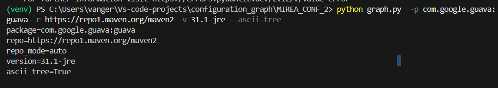
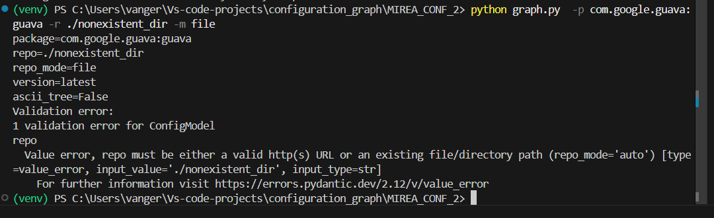
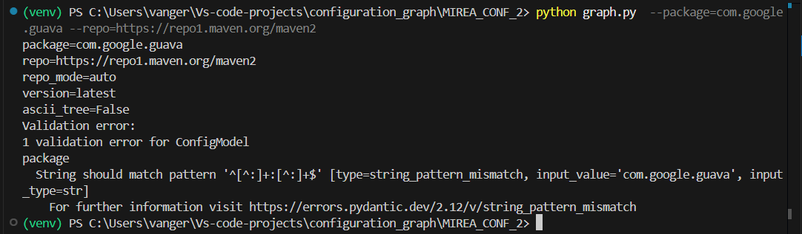

# Этап 1. Ввод и валидация параметров
## Общее описание
CLI-приложение для визуализации графа зависимостей
На этапе 1: Реализовано минимальное CLI-приложение с вывод введеных параметров.
## Реализованы функции
1. Запуск приложения из командной строки с параметрами.
2. Вывод переданных параметров.
3. Валидация переданных параметров.

## Пример работы программы
Пример корректно переданных параметров:




Пример некорректного параметра(несуществующий путь):




Пример некорректного параметра(неправильный формат наименования Java Maven файла):




## Установка и запуск
```bash
# Клонируем репозиторий
git clone https://github.com/vanger2607/MIREA_CONFIGURATION.git

# Переходим в папку проекта
cd MIREA_CONF_2

# Создаём виртуальное окружение
python -m venv venv
# Активируем виртуальное окружение:
.\venv\Scripts\activate 
# устанавливаем зависимости
pip install -r requirements.txt
# Запускаем CLI-терминал
python graph.py

# Команды-примеры
# Пример корректного сценария:
python graph.py  -p com.google.guava:guava -r https://repo1.maven.org/maven2 -v 31.1-jre --ascii-tree

# Пример неправильный формат package:
python graph.py  --package=com.google.guava --repo=https://repo1.maven.org/maven2

# Пример несуществующий путь:
python graph.py  -p com.google.guava:guava -r ./nonexistent_dir -m file
